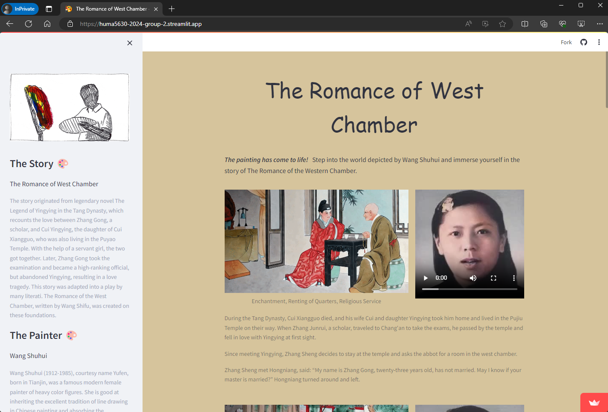
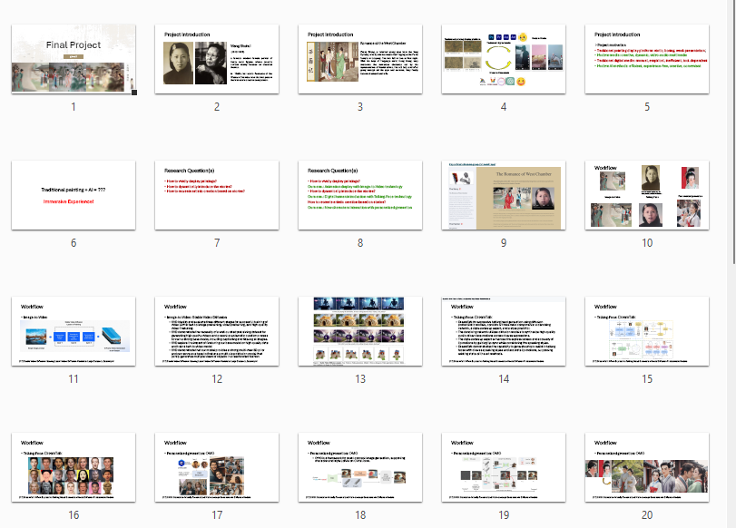

# Group Project for HUMA5630 Digital Humanities

| Student Name | UID | UST email | Github username |
| ------------ | --- | --------- | --------------- |
|    Li Lujun   | 21010149 | lliee@connect.ust.hk | [@lilujunai](https://github.com/lilujunai) |
|    Du Yiwen  | 21072707 | ydubm@connect.ust.hk | [@DuYiwen93](https://github.com/DuYiwen93) |
|  Gu Jingran  | 20997182 | jguam@connect.ust.hk |   [@GJR57](https://github.com/GJR57)   |        

# Topic
Let Wang Shuhui’s The Romance of the West Chamber come alive
让王叔晖笔下的《西厢记》动起来

# URL
https://huma5630-2024-group-2.streamlit.app/

# Presentation Slides
[PDF version](https://github.com/HUMA5630-Digital-Humanities/project-2024-group-2/blob/main/Final%20Project%20-%20Group2.pdf)

